# 使用教程

**没有python基础无法使用dalle3？ai画图软件参数太多不知道作用？我们将会为你解决一切烦恼，用最简单的操作为你实现最理想的效果，即使是小学生也可以轻松使用的ai绘图程序，简单明了，轻松挑战不可能**

## Reverse Proxy Link

## Key
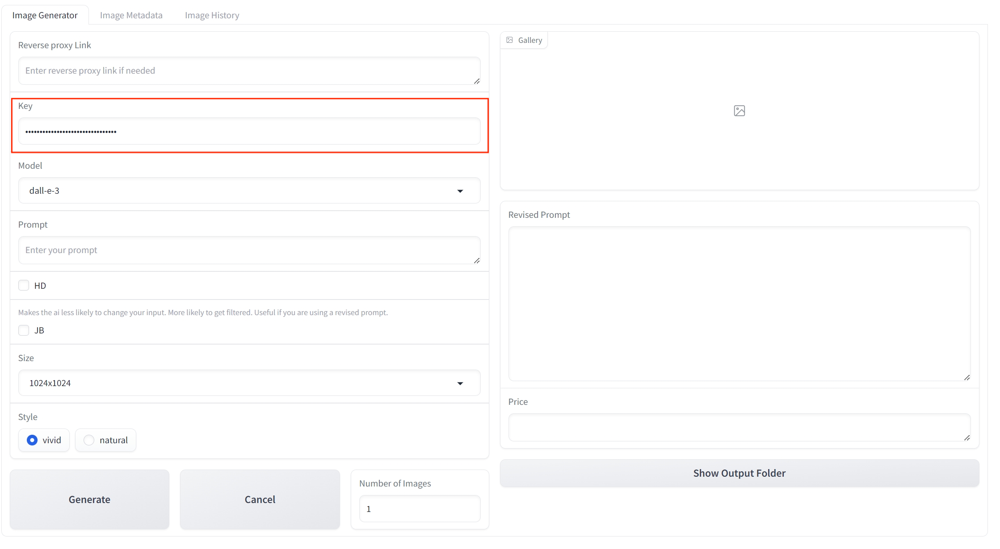

输入你的密钥，点击 [这里](https://ai.voilatech.co.jp/) 在我们的官网获取更加方便的 API 密钥，或者可以在 OpenAI 官网获取。k

## Model
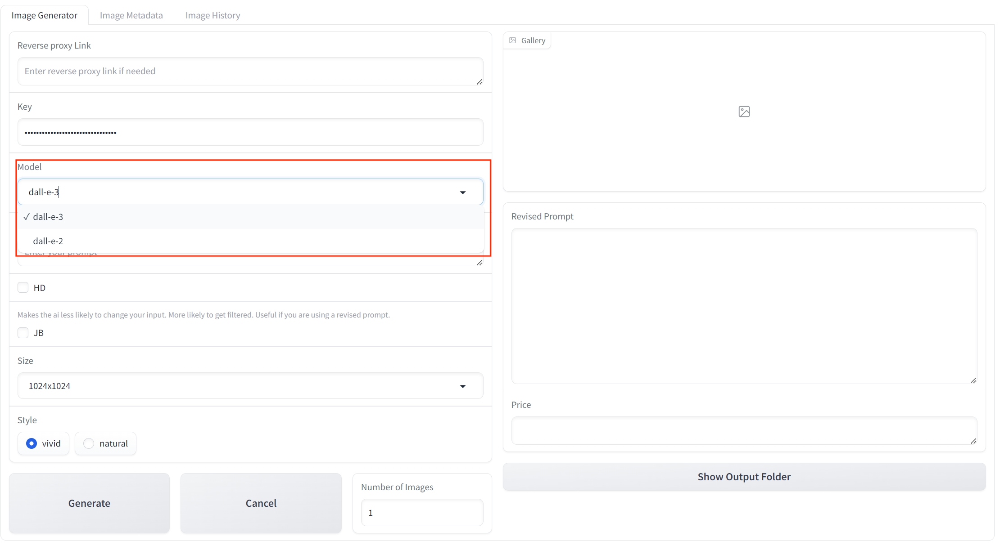

选择你的生成模型，目前支持 DALL·E 2 和 DALL·E 3 两种：
- DALL·E 3 对于提示词的刻画更为精准，但是价格更高；
- 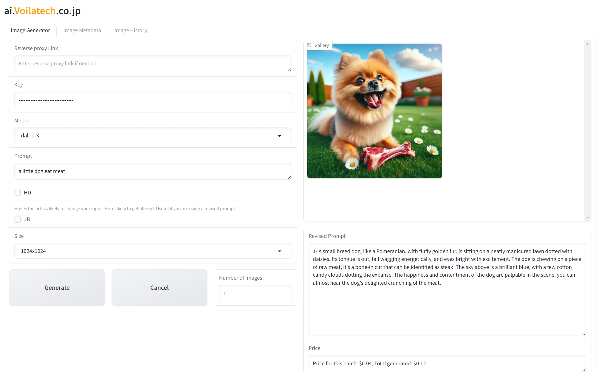

- DALL·E 2 的效果稍逊于 DALL·E 3 但是价格更低。
- 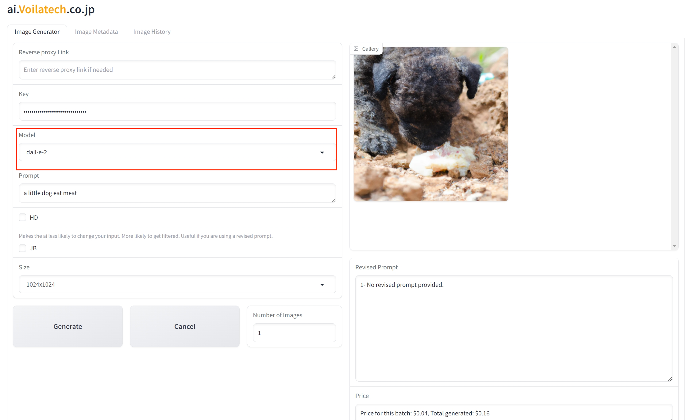

## Prompt
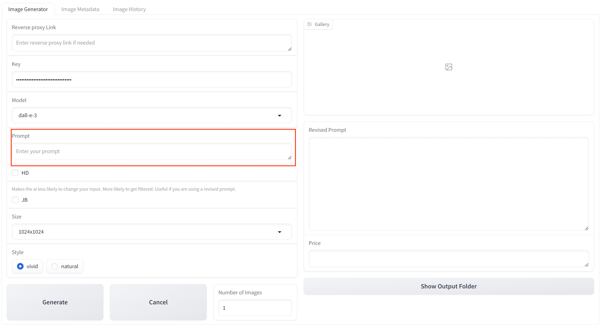

输入你的提示词，尽可能精准描述你理想的图片，以确保你的图片达到理想效果（不熟悉提示词用法的用户也不用担心，我们会自动修正你的提示词来达到最好的效果）。

## HD
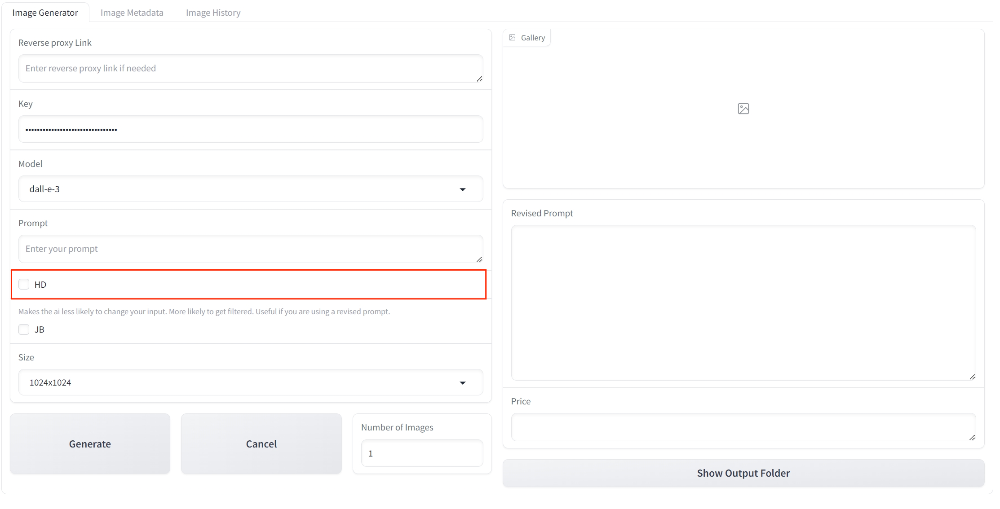

可以帮助你生成更加清晰的图片，但是价格也会同时升高。
###HD:
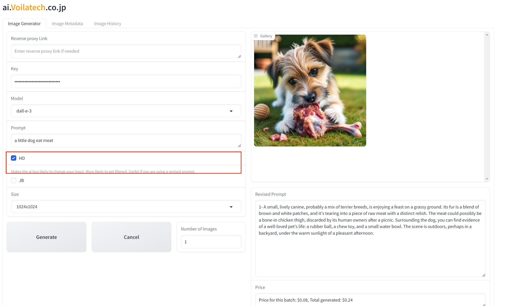
###NOT HD:

## JB
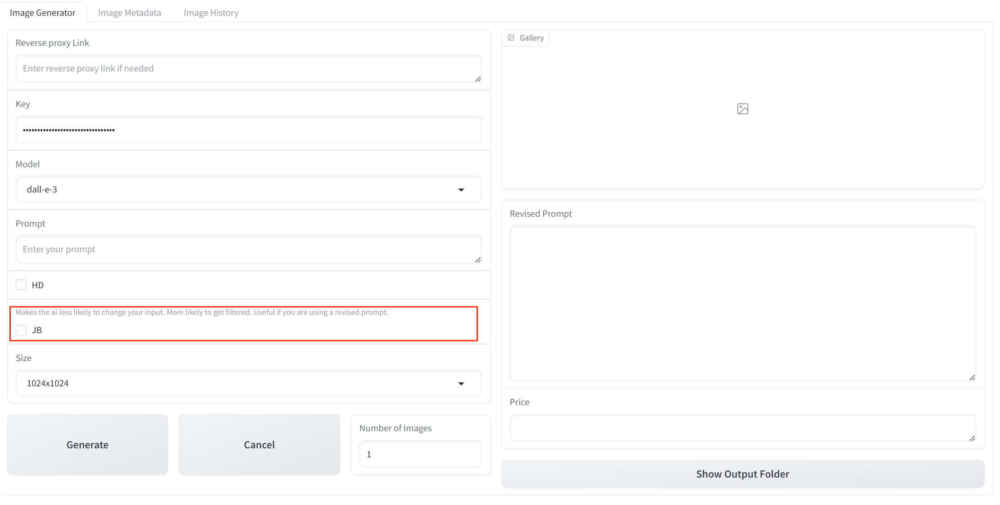
使人工智能更不容易改变你的输入，确保 AI 完全遵循你的提示词来刻画图片。如果你对你的提示词十分有信心或者采用的是修订后的提示词，可以勾选。
###JB:
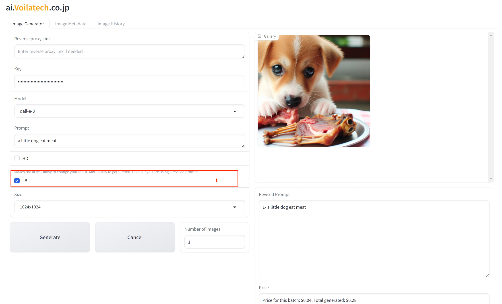
###NOT JB:

## Size
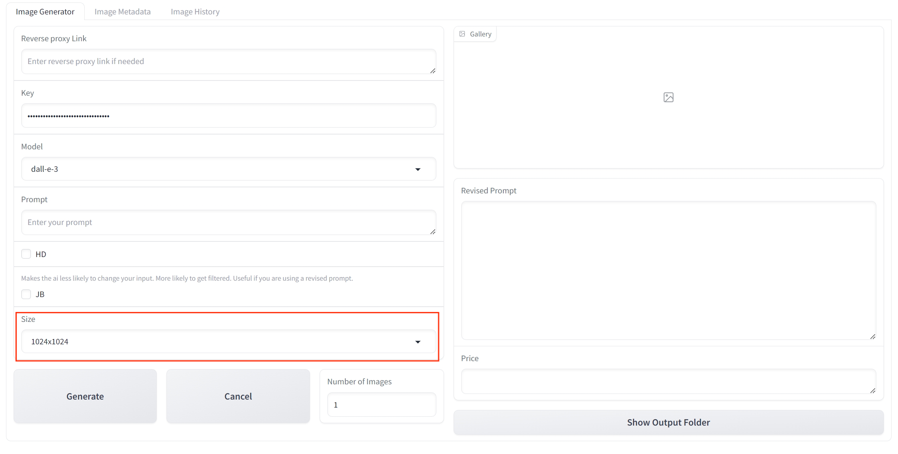
你可以在这里选择图片的尺寸，DALL·E 2 和 DALL·E 3 所支持的尺寸有所不同，请你选择最合适的来作为你的生成模型：
- **DALL·E 2**： 
  - 1024x1024
  - 512x512
  - 256x256
- **DALL·E 3**：
  - 1024x1024
  - 1024x1792
  - 1792x1024

## Style
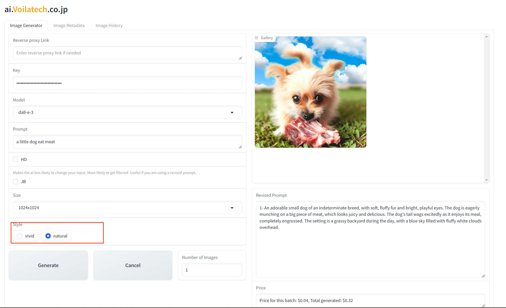
一共有vivid和natural两种格式可以选择，vivid提供更为理想化的图片，而natural则提供更加自然和真实的图片
###vivid：
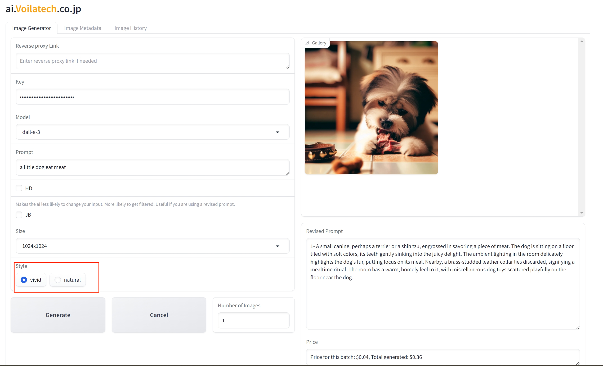
###natural：

## Number of Images
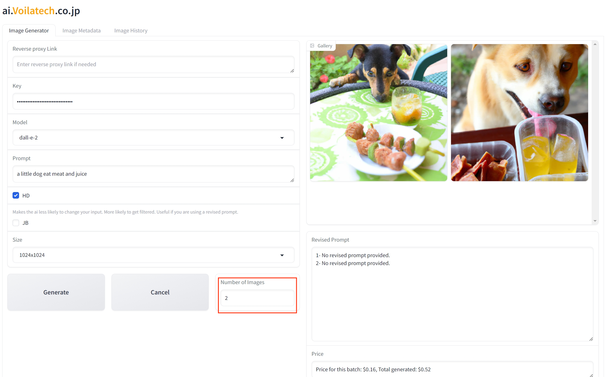
选择你要生成的图片数量，不建议一次生成太多，以避免额外的花费。

## Revised Prompt
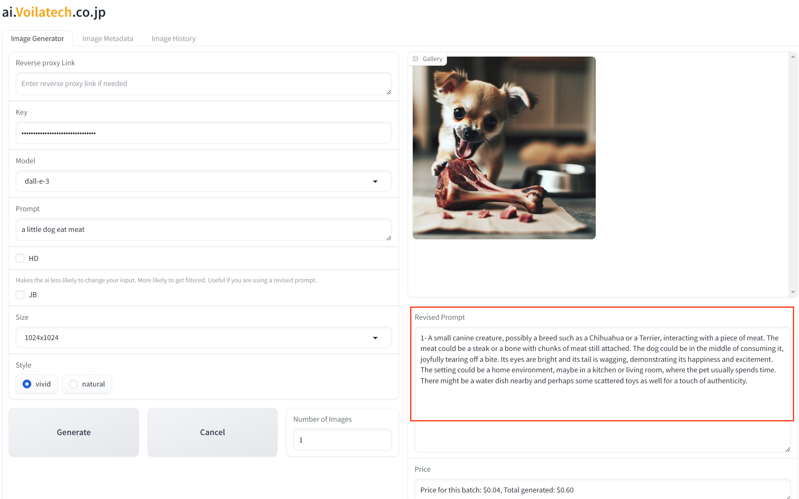
我们会使用 AI 对你的提示词进行修正，以便生成最符合你预期的图片。新生成的提示词会在 Revised Prompt 部分显示。

## Price
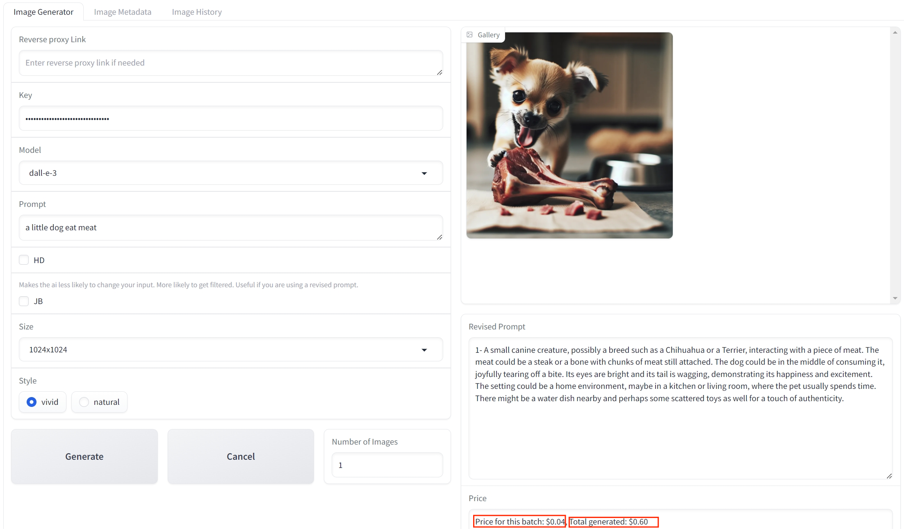
在这里我们会为你显示生成这些图片时所花费的价格，前者是你生成当前这个图片时花费的价格，后者是你生成所有图片时所花费的总价格。

## Image History
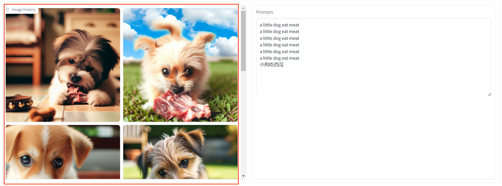
在这里会记录你所生成的所有图片，以避免生成理想的图片却因为没有及时保存而造成的问题。

## Prompts History

这里记录了你生成的所有图片所用的提示词。
