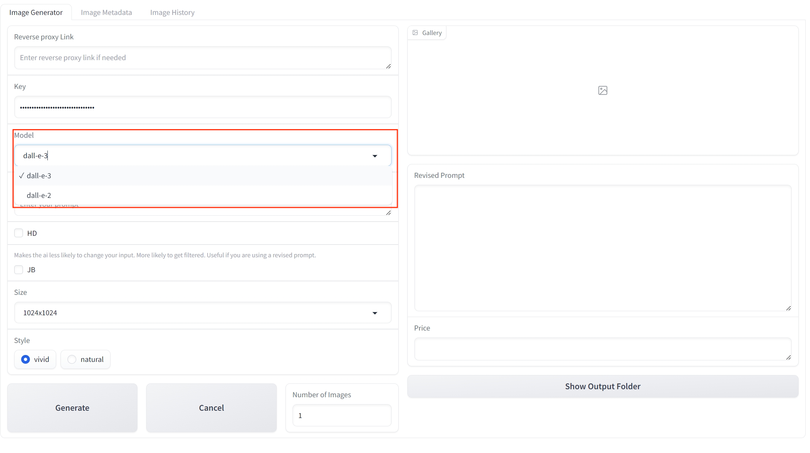
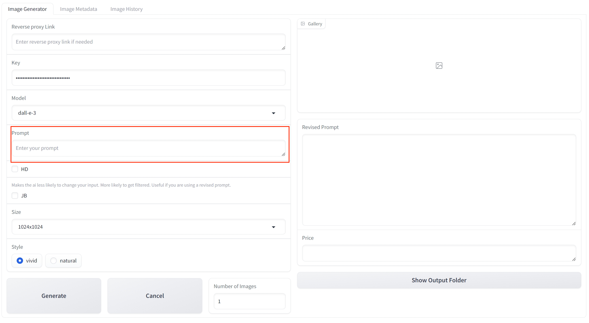
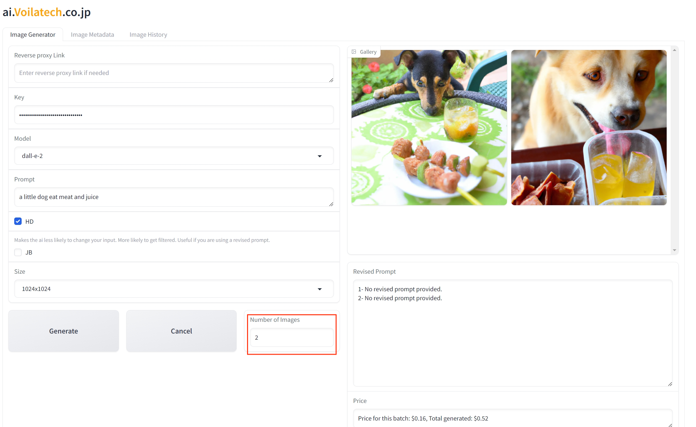
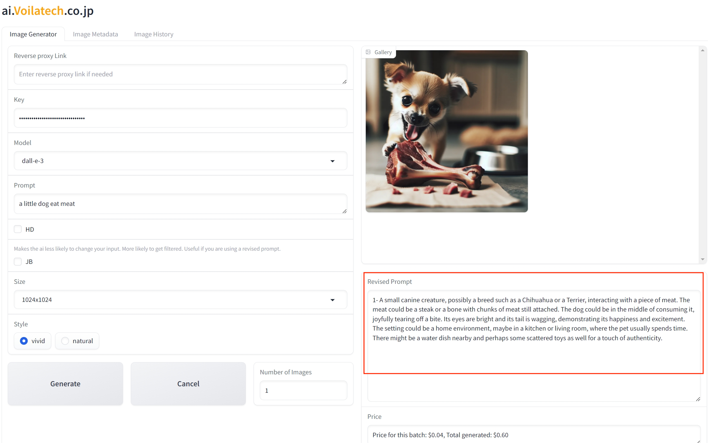

**[English version of the tutorial, click here](./english.md)**

**[日本語版の使用チュートリアルはここをクリック](./japanese.md)**

# Tutorial

**No Python background and can't use DALL·E 3?** *Too many AI drawing software parameters and don't know their functions?*

We are here to solve all your worries. With ***the simplest operations***, we will help you achieve **the most ideal results**, making it easy for even elementary school students to use an AI drawing program. It's simple, clear, and ready to tackle the impossible.

## Table of Contents
- [Reverse Proxy Link](#reverse-proxy-link)
- [Key](#key)
- [Model](#model)
- [Prompt](#prompt)
- [HD](#hd)
- [JB](#jb)
- [Size](#size)
- [Style](#style)
- [Number of Images](#number-of-images)
- [Revised Prompt](#revised-prompt)
- [Price](#price)
- [Image History](#image-history)
- [Prompts History](#prompts-history)

## Reverse Proxy Link
If your geographic location or network environment restricts direct access to the API, please use our provided reverse proxy service to ensure smooth operations.

## Key

Enter your API key here. Click [here](https://ai.voilatech.co.jp/) to obtain a convenient API key from our official website, or you can obtain it from the OpenAI official website.
> **Note**: Previously, some customers reported that OpenAI's API **only supports credit card payments** and is **not available in certain regions**. Therefore, we have launched our proxy API, which supports **more payment methods and can be smoothly used in various regions** to meet the diverse needs of more customers.

## Model

Choose the model for generation. Currently, we support DALL·E 2 and DALL·E 3:
- **DALL·E 3**: Provides **more accurate** depiction based on prompts, but **is more expensive**;
- **DALL·E 2**: Offers results that are **slightly inferior** to DALL·E 3, but **is cheaper**.

## Prompt

Enter your prompt. Describe your ideal image as **accurately as possible** to ensure the generated image meets your expectations. (Users unfamiliar with prompt usage don't need to worry; we will **automatically correct** your prompts to achieve the best results.)

## HD

This option helps you generate **higher clarity** images, but the cost will increase accordingly.

### HD:

### NOT HD:

## JB

Checking this option will make the AI **less likely to alter your input**, ensuring that the AI strictly follows your prompts to depict the image. If you are confident in your prompt, or are using a revised prompt, you can check this option.

### JB:

### NOT JB:

## Size

You can choose the size of the image here. The **supported sizes differ** between DALL·E 2 and DALL·E 3, so please choose the most suitable one for your model:
- **DALL·E 2**:
  - 1024x1024
  - 512x512
  - 256x256
- **DALL·E 3**:
  - 1024x1024
  - 1024x1792
  - 1792x1024

## Style

You can choose between two styles: vivid and natural. Vivid provides a more **virtualized** image, while natural offers a more **realistic and natural** image.

### Vivid:

### Natural:

## Number of Images

Choose the number of images you want to generate. It is not recommended to generate too many at once to **avoid additional costs**.
> **Note**: When generating multiple images at once, only similar images based on a single prompt can be generated, not a sequence of images that tell a story as described by the prompt. For example, if the prompt describes a story, the generated images will be similar images rather than a series of images that narrate the story.

## Revised Prompt

We will use AI to **correct your prompt** to generate the most suitable image. The newly generated prompt will be displayed in the Revised Prompt section.

## Price

Here, we will display the cost of generating these images. The first figure shows the cost of generating **the current image**, and the second figure shows the total cost of generating **all images**.

## Image History

All images you generate will be recorded here to prevent the loss of ideal images due to not saving them in time.

## Prompts History

Here, all prompts used to generate images are recorded for future reference and reuse.

---

We sincerely thank you for choosing our AI drawing program. We are committed to providing the simplest and most intuitive user experience, helping every user realize their creativity with ease. Your support and feedback are the driving force behind our continuous improvement.

If you have any questions or suggestions, please feel free to [contact us](https://ai.voilatech.co.jp/). **We look forward to exploring the limitless possibilities of AI drawing with you!**

---
