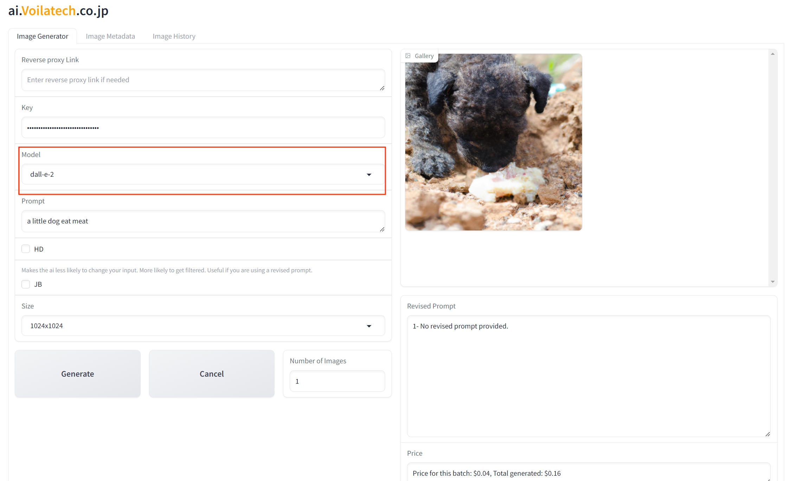
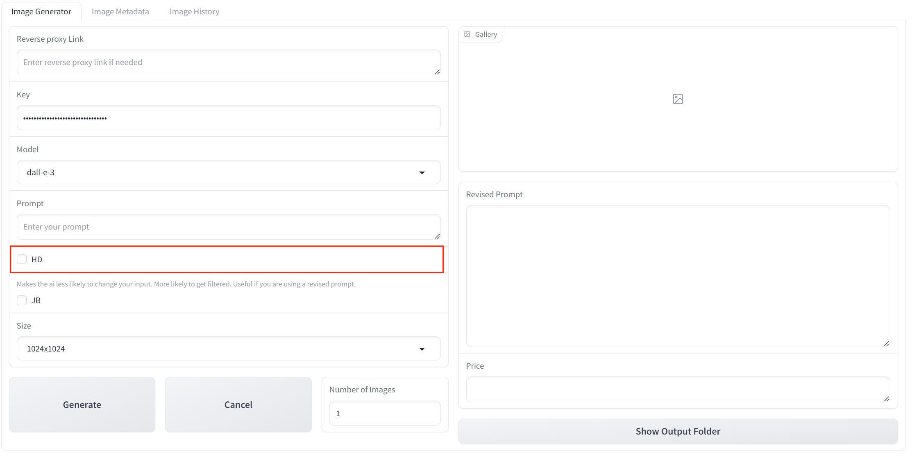
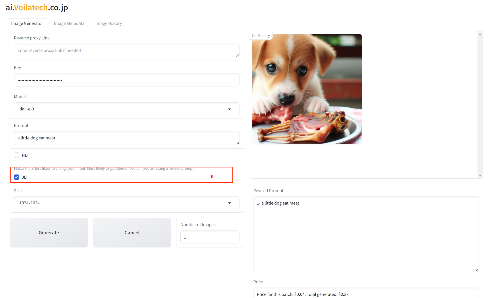
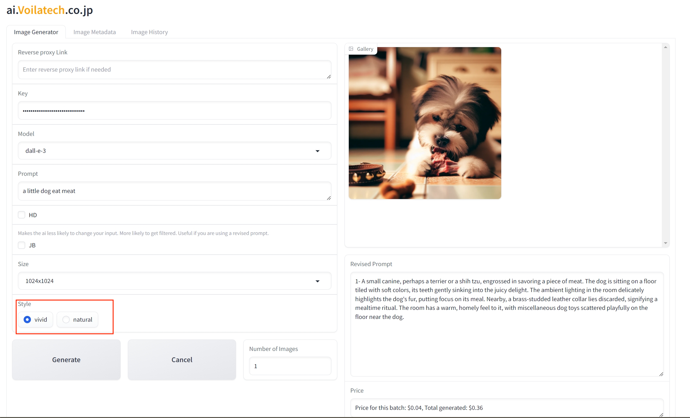
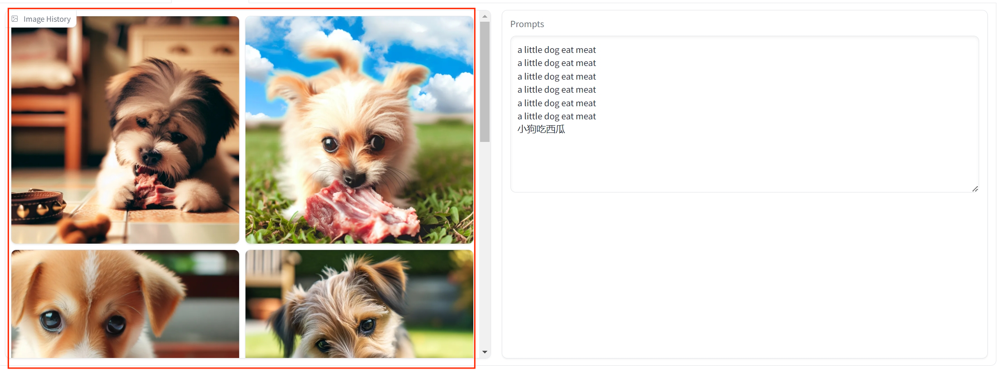

# 使用ガイド

**Python の知識がなくても DALL·E 3 を使用できる？** *AI 画像生成ソフトのパラメータが多すぎてわからない？*

私たちは***最も簡単な操作***で、**理想的な結果**を実現するお手伝いをします。小学生でも簡単に使用できるAI描画プログラムで、シンプルかつ明瞭に、不可能に挑戦することができます。

## リバースプロキシリンク

## キー

ここにAPIキーを入力します。より便利なAPIキーを取得するには、[こちら](https://ai.voilatech.co.jp/)をクリックして公式ウェブサイトから取得するか、OpenAI の公式ウェブサイトから取得できます。
（一部の顧客から、OpenAI の API が**クレジットカード決済のみ**に対応しており、**一部の地域では使用できない**との報告がありました。そのため、私たちは**より多くの支払い方法**をサポートし、**すべての地域でスムーズに使用できる**プロキシAPIを導入し、より多様なニーズに応えられるようにしました。）

## モデル

画像生成に使用するモデルを選択します。現在、DALL·E 2 と DALL·E 3 の両方をサポートしています：
- DALL·E 3 は、プロンプトに基づいてより**正確な描写**を行いますが、**価格が高い**です。
- DALL·E 2 の結果は、DALL·E 3 よりも**やや劣ります**が、**価格が安い**です。

## プロンプト

ここにプロンプトを入力します。理想の画像が期待通りに生成されるように、できるだけ**正確に説明**してください。（プロンプトの使い方に不慣れな方もご安心ください。最適な結果が得られるよう、私たちが**自動的に修正**します。）

## HD

このオプションを有効にすると、**高解像度の画像**を生成できますが、コストも増加します。

### HD:

### NOT HD:

## JB

このオプションを選択すると、AI が**入力を変更しにくくなり**、プロンプトを正確に反映することができます。プロンプトに自信がある場合や、修正されたプロンプトを使用する場合は、このオプションを選択できます。

### JB:

### NOT JB:

## サイズ

ここで画像のサイズを選択できます。DALL·E 2 と DALL·E 3 では**サポートされるサイズが異なる**ため、モデルに最も適したサイズを選択してください：
- **DALL·E 2**: 
  - 1024x1024
  - 512x512
  - 256x256
- **DALL·E 3**:
  - 1024x1024
  - 1024x1792
  - 1792x1024

## スタイル

スタイルは vivid と natural の2種類から選択できます。vivid はより**仮想的な**画像を提供し、natural はより**現実的で自然な**画像を提供します。

### vivid：

### natural：

## 画像の数

生成する画像の数を選択します。一度にあまり多くの画像を生成すると、余計なコストがかかる可能性があるため、おすすめしません。

## 修正されたプロンプト

私たちは、最も適切な画像を生成するために、AI を使用して**プロンプトを修正**します。新しく生成されたプロンプトは、修正されたプロンプトセクションに表示されます。

## 価格

ここで、これらの画像を生成する際のコストが表示されます。最初の価格は**現在の画像**を生成するための価格で、2つ目は**すべての画像**を生成するための総コストです。

## 画像履歴

ここには生成されたすべての画像が記録され、理想的な画像を保存し忘れてしまう問題を防ぎます。

## プロンプト履歴

ここには、画像生成に使用されたすべてのプロンプトが記録されており、将来の参考に使用できます。