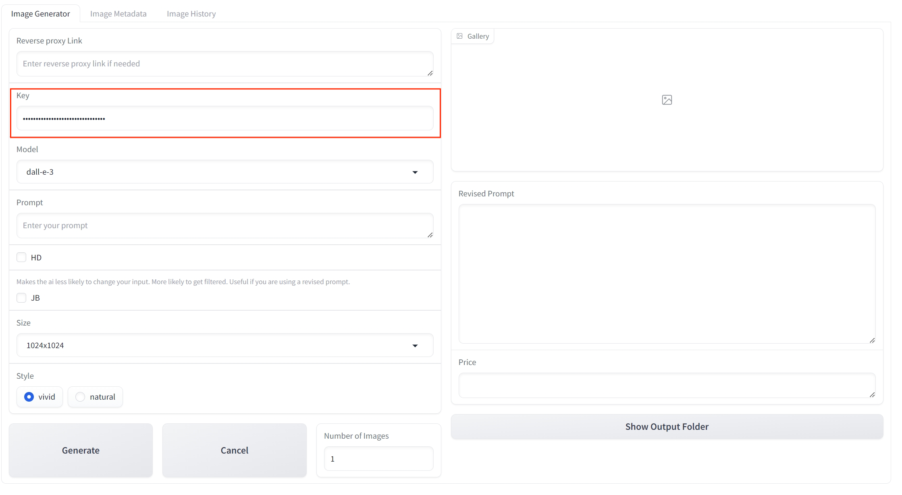
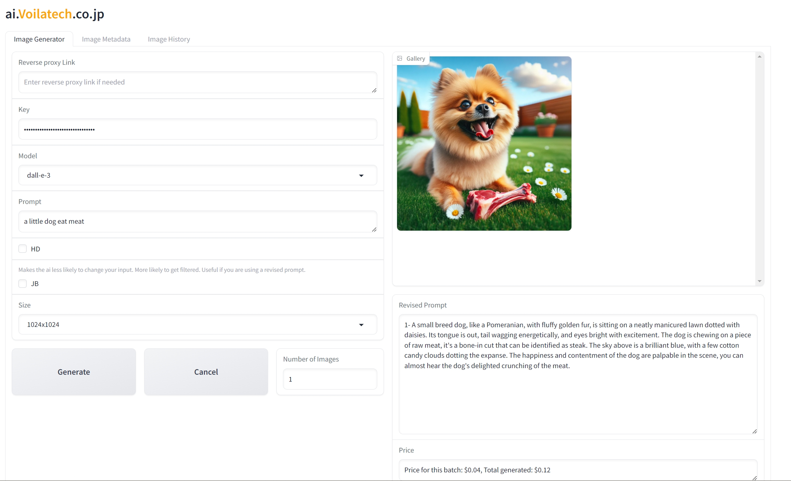
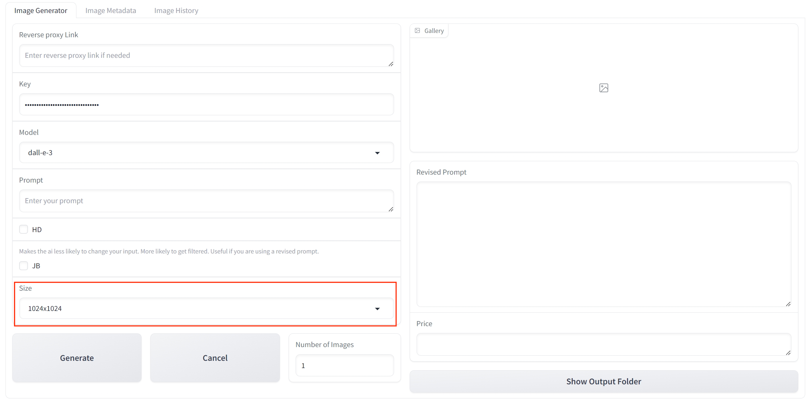

**[English version of the tutorial, click here](./english.md)**

**[日本語版の使用チュートリアルはここをクリック](./japanese.md)**

# 使用チュートリアル

**Pythonの知識がなくてもDALL·E 3を使えない?** *AI描画ソフトのパラメータが多すぎて理解できない?*

私たちは、***最も簡単な操作***で**理想的な結果**を実現するお手伝いをします。小学生でも簡単に使えるAI描画プログラムを提供し、シンプルで明快な操作で不可能に挑戦しましょう。

## 目次
- [Reverse Proxy Link](#reverse-proxy-link)
- [Key](#key)
- [モデル](#モデル)
- [プロンプト](#プロンプト)
- [高画質 (HD)](#高画質-hd)
- [厳密モード (JB)](#厳密モード-jb)
- [サイズ](#サイズ)
- [スタイル](#スタイル)
- [画像数](#画像数)
- [修正プロンプト](#修正プロンプト)
- [料金](#料金)
- [画像履歴](#画像履歴)
- [プロンプト履歴](#プロンプト履歴)

## Reverse Proxy Link
地理的な位置やネットワーク環境がAPIへの直接アクセスを制限している場合は、提供されたリバースプロキシサービスを利用して、スムーズな操作を確保してください。

## Key

ここにAPIキーを入力してください。便利なAPIキーを入手するには、公式ウェブサイトの[こちら](https://ai.voilatech.co.jp/)からアクセスするか、OpenAIの公式ウェブサイトで取得してください。
> **注意**: 以前、一部の顧客からOpenAIのAPIが**クレジットカード払いのみ対応**し、**特定の地域では使用できない**との報告がありました。そのため、私たちはプロキシAPIを導入し、**より多様な支払い方法に対応し、さまざまな地域でスムーズに利用できる**ようにしました。これにより、より多くの顧客の多様なニーズに応えることが可能です。

## モデル

生成モデルを選択します。現在、DALL·E 2とDALL·E 3の2つをサポートしています。
- **DALL·E 3**: プロンプトに基づいて**より正確に**描写しますが、**コストが高い**です。
- **DALL·E 2**: DALL·E 3よりも**若干劣る**描写結果ですが、**コストが低い**です。

## プロンプト

プロンプトを入力してください。理想の画像を**できるだけ正確に**説明して、生成された画像が期待通りになるようにします。（プロンプトの使い方に慣れていないユーザーでも心配ありません。**自動的にプロンプトを修正**して最適な結果を得られるようにします。）

## 高画質 (HD)

このオプションを選択すると、**より高画質な**画像を生成できますが、その分コストも増加します。

### HD:

### NOT HD:

## 厳密モード (JB)

このオプションを選択すると、AIが**入力を変更しにくく**なり、AIがプロンプトを完全に守って画像を描写するようにします。プロンプトに自信がある場合や修正されたプロンプトを使用している場合は、このオプションを選択できます。

### JB:

### NOT JB:

## サイズ

ここで画像のサイズを選択できます。DALL·E 2とDALL·E 3では**対応するサイズが異なります**ので、モデルに最適なサイズを選んでください。
- **DALL·E 2**:
  - 1024x1024
  - 512x512
  - 256x256
- **DALL·E 3**:
  - 1024x1024
  - 1024x1792
  - 1792x1024

## スタイル

2つのスタイル、vividとnaturalから選択できます。vividはより**仮想的な**画像を提供し、naturalはより**自然でリアルな**画像を提供します。

### vivid:

### natural:

## 画像数

生成する画像の枚数を選択してください。一度にあまり多く生成しないことをお勧めします。**追加コストを避けるため**です。
> **注意**: 複数の画像を同時に生成するときは、単一のプロンプトに基づく類似画像しか生成できず、プロンプトで説明されたような連続したストーリーを表す画像は生成されません。例えば、プロンプトで物語を説明している場合、生成された画像は類似の画像であり、物語を語る一連の画像ではありません。

## 修正プロンプト

AIを使用してプロンプトを**修正**し、最も適切な画像を生成します。新たに生成されたプロンプトは修正プロンプトセクションに表示されます。

## 料金

ここでは、これらの画像を生成する際にかかる費用を表示します。最初の数字は**現在の画像**を生成する際の費用で、2番目の数字は**すべての画像**を生成する際の総費用です。

## 画像履歴

生成したすべての画像がここに記録され、理想的な画像を保存し忘れるという問題を防ぎます。

## プロンプト履歴

ここには、画像を生成する際に使用したすべてのプロンプトが記録されます。必要に応じていつでも参照できます。

---

私たちのAI描画プログラムをお選びいただき、誠にありがとうございます。私たちは、最も簡単で直感的なユーザー体験を提供し、すべてのユーザーが創造性を簡単に実現できるように努めています。お客様のご支援とフィードバックが、私たちの継続的な改善と前進の原動力です。

ご不明な点やご提案がございましたら、[お問い合わせ](https://ai.voilatech.co.jp/)ください。**AI描画の無限の可能性を一緒に探求していきましょう！**

---
